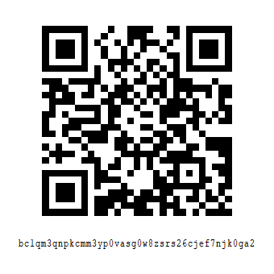

# PotoHEX

[<table align=center border=0 cellspacing=0 cellpadding=0 style="overflow: hidden !important;"><tr><td></td><td><a href="https://apps.apple.com/us/app/potohex/id1620963302">PotoHEX</a> HEX File Viewer & Editor</td><tr></table>]()

I will release it "for free" (with the source code in this repo) for all significant iOS versions if it is sponsored in the amount of at least 2 BTC 😉

[<table align=center cellspacing=0 cellpadding=0 style="overflow: hidden !important;"><tr><td>bitcoin:BC1QM3QNPKCMM3YP0VASG0W8ZSRS26CJEF7NJK0GA2</td></tr><tr><td align=center></td></tr></table>]()

